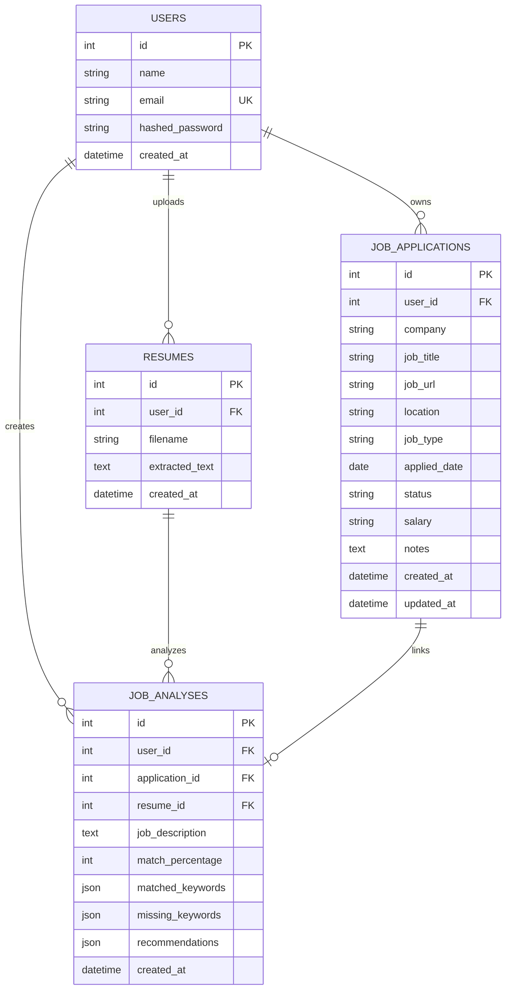

# Smart Job Application Tracker & Resume Analyzer

A production-style full-stack web application for tracking recruitment pipelines and analyzing resumes against job descriptions using rule-based keyword extraction, skill gap detection, and match scoring.

Built with **React (Vite + Tailwind CSS)**, **FastAPI (Python)**, **SQLAlchemy**, and **PostgreSQL**.

---

## 🌟 Overview

Job hunting often involves applying to dozens of opportunities across multiple stages without a unified system to organize applications or evaluate how well a resume aligns with specific job requirements.

**Smart Job Application Tracker & Resume Analyzer** solves this problem by providing:
1. **Application Pipeline Management**: Complete CRUD, status workflow tracking (`Applied`, `Screening`, `Interview`, `Assessment`, `Offer`, `Rejected`, `Withdrawn`), and server-side filtering.
2. **Dashboard Analytics**: Real-time KPI metrics (Interview Rate %, Offer Rate %), pipeline stage distribution charts, and application volume trends.
3. **Smart Resume Analyzer**: PDF text extraction, technical skill taxonomy parsing, alignment scoring, and missing keyword discovery.
4. **Data Isolation**: Strict user-level authorization ensuring each user only accesses their own applications, resumes, and reports.

---

## 🛠️ Tech Stack

### Frontend
- **Framework**: React 18 + Vite
- **Styling**: Tailwind CSS (Modern SaaS Dashboard design)
- **Routing**: React Router v6
- **HTTP Client**: Axios (Centralized instance with JWT interceptors & 401 handler)
- **Charts**: Recharts (Responsive bar and area trend charts)
- **Icons**: Lucide React

### Backend
- **Framework**: FastAPI (Python 3.11+)
- **ORM / Database**: SQLAlchemy 2.0 + PostgreSQL (with SQLite zero-config fallback)
- **Data Validation**: Pydantic v2
- **PDF Text Extraction**: `pypdf`
- **Authentication**: JWT (JSON Web Tokens) with `pyjwt` and `bcrypt` password hashing
- **Testing**: `pytest` + `httpx` (14 automated test suites)

---

## 🏛️ System Architecture

```
                    ┌────────────────────────────────────────────────────────┐
                    │               React Single Page App (Vite)             │
                    │   Dashboard • Applications • Analyzer • Account        │
                    └──────────────────────────┬─────────────────────────────┘
                                               │
                                 Axios (Bearer JWT Auth)
                                               │
                                               ▼
                    ┌────────────────────────────────────────────────────────┐
                    │               FastAPI REST API Layer                   │
                    │   /api/auth • /api/applications • /api/resumes ...    │
                    └────────────┬─────────────────────────────┬─────────────┘
                                 │                             │
                     Service & Business Layer           PyPDF Parser
                                 │                             │
                       Keyword Matcher Engine           PDF Text Stream
                                 │                             │
                                 ▼                             ▼
                    ┌────────────────────────────────────────────────────────┐
                    │                  SQLAlchemy ORM Layer                  │
                    │   Users • JobApplications • Resumes • JobAnalyses      │
                    └──────────────────────────┬─────────────────────────────┘
                                               │
                                       Connection Pool
                                               │
                                               ▼
                    ┌────────────────────────────────────────────────────────┐
                    │                   PostgreSQL Database                  │
                    └────────────────────────────────────────────────────────┘
```

---

## 🗄️ Database Schema & Models



---

## 🔍 Resume Matching Algorithm & Formula

The matching engine employs a deterministic, rule-based approach:

1. **Taxonomy Scanning**: The job description is scanned against a curated technical dictionary (Languages, Frameworks, Cloud, Databases, DevOps, Tools).
2. **Regex Normalization**: Pattern boundaries and aliases handle variations (e.g., `React.js` / `ReactJS` $\rightarrow$ `React`, `PostgreSQL` / `postgres` $\rightarrow$ `PostgreSQL`, `k8s` $\rightarrow$ `Kubernetes`).
3. **Resume Intersect**: The candidate's extracted resume text is evaluated against the identified job requirements.
4. **Scoring Formula**:

$$\text{Match Percentage} = \operatorname{round}\left( \frac{|\text{Matched Requirements}|}{\max(|\text{Total Job Requirements}|, 1)} \times 100 \right)$$

5. **Skill Gap Discovery**:
   - $\text{Matched Skills} = \text{JD Skills} \cap \text{Resume Skills}$
   - $\text{Missing Skills} = \text{JD Skills} \setminus \text{Resume Skills}$
6. **Actionable Suggestions**: Generates tailored recommendations highlighting specific skill areas and project bullet optimizations.

---

## 🚀 Quick Start & Local Setup

### Prerequisites
- Python 3.10+
- Node.js 18+ and npm

### 1. Backend Setup
```bash
# Navigate to backend directory
cd backend

# Create and activate virtual environment
python -m venv venv

# Windows:
.\venv\Scripts\activate
# macOS/Linux:
# source venv/bin/activate

# Install dependencies
pip install -r requirements.txt

# Create .env from example (defaults to SQLite for instant local run or PostgreSQL)
cp .env.example .env

# (Optional) Seed demo data
python seed.py

# Start FastAPI server
uvicorn app.main:app --reload --port 8000
```
- API is accessible at: `http://127.0.0.1:8000`
- Interactive Swagger UI: `http://127.0.0.1:8000/docs`

### 2. Frontend Setup
```bash
# Open a new terminal and navigate to frontend
cd frontend

# Install dependencies
npm install

# Start Vite development server
npm run dev
```
- Frontend application is live at: `http://localhost:5173`

### 3. Demo Credentials
If you ran `python seed.py`, log in with:
- **Email**: `demo@jobtracker.dev`
- **Password**: `demo123456`
*(Or click the "⚡ Use Demo Account" button on the login screen).*

---

## 🧪 Automated Testing

The backend includes comprehensive test coverage for auth, CRUD, search/filter, resume parsing, keyword matching, and cross-user data security.

```bash
cd backend
pytest -v
```

---

## 📡 REST API Catalog

| Method | Endpoint | Description | Auth Required |
|---|---|---|---|
| `POST` | `/api/auth/register` | Register a new user | No |
| `POST` | `/api/auth/login` | Log in and receive JWT token | No |
| `GET` | `/api/auth/me` | Fetch authenticated user profile | Yes |
| `GET` | `/api/applications` | List applications (supports `status`, `search`, `sort_by`) | Yes |
| `POST` | `/api/applications` | Create a job application | Yes |
| `GET` | `/api/applications/{id}` | Retrieve single application details | Yes |
| `PUT` | `/api/applications/{id}` | Update application fields or status | Yes |
| `DELETE` | `/api/applications/{id}` | Delete a job application | Yes |
| `POST` | `/api/resumes/upload` | Upload PDF and extract text | Yes |
| `GET` | `/api/resumes` | List user resumes | Yes |
| `DELETE` | `/api/resumes/{id}` | Delete uploaded resume | Yes |
| `POST` | `/api/analysis/analyze` | On-demand resume vs JD analysis | Yes |
| `POST` | `/api/analysis/save` | Persist analysis record to DB | Yes |
| `GET` | `/api/analysis/application/{id}` | Get analysis attached to application | Yes |
| `GET` | `/api/dashboard/stats` | Pipeline metrics & timeline trends | Yes |

---

## 🔒 Security Architecture

1. **Password Hashing**: Stored using modern `bcrypt` key derivation with cryptographic salt.
2. **JWT Authentication**: Signed with HS256 and configurable expiration time (`ACCESS_TOKEN_EXPIRE_MINUTES`).
3. **Data Isolation**: All database queries enforce `user_id == current_user.id`, preventing horizontal privilege escalation (IDOR attacks).
4. **Input Validation**: Pydantic v2 models validate request payloads, email formats, and string lengths before reaching database execution.
5. **PDF Upload Guard**: Validates file extension, MIME type, stream validity, and enforces a 10MB upload ceiling.

---

## 🚢 Deployment Guide

### Backend (Render / Railway / Fly.io)
1. Set Environment Variables:
   - `DATABASE_URL`: `postgresql://<user>:<password>@<host>:<port>/<db>`
   - `SECRET_KEY`: Long random string (32+ characters)
   - `CORS_ORIGINS`: `["https://your-frontend.vercel.app"]`
2. Start Command:
   `uvicorn app.main:app --host 0.0.0.0 --port $PORT`

### Frontend (Vercel / Netlify)
1. Set Environment Variable:
   - `VITE_API_URL`: `https://your-backend-api.onrender.com/api`
2. Build Command: `npm run build`
3. Output Directory: `dist`

---

## 💡 What I Learned (Interview Preparation Guide)

### 1. Full-Stack State & Auth Coordination
- **Challenge**: Managing synchronous UI state alongside asynchronous token expiry.
- **Solution**: Centralized Axios response interceptors that catch `401 Unauthorized` responses and clear stale `localStorage` keys while redirecting to `/login`.

### 2. PDF Parsing without System Bottlenecks
- **Challenge**: Extracting text from binary PDFs in memory without saving temporary files to disk.
- **Solution**: Leveraged `pypdf.PdfReader` with `io.BytesIO(file_bytes)` to extract text in memory, cleaning non-printable characters and normalizing whitespace before database storage.

### 3. Rule-Based vs. Black-Box Analysis
- **Challenge**: Providing consistent, defendable resume alignment without making the entire application dependent on expensive or unpredictable external LLM APIs.
- **Solution**: Designed a transparent keyword extraction taxonomy using boundary-safe regex patterns and set operations to compute deterministic match percentages and clear missing skill lists.

### 4. Database Isolation Patterns
- **Challenge**: Preventing unauthorized access when users manipulate entity IDs in URL routes (`/api/applications/42`).
- **Solution**: FastAPI dependency injection (`get_current_user`) guarantees the user identity from the verified JWT payload, and SQLAlchemy queries explicitly filter by `user_id == current_user.id`.
